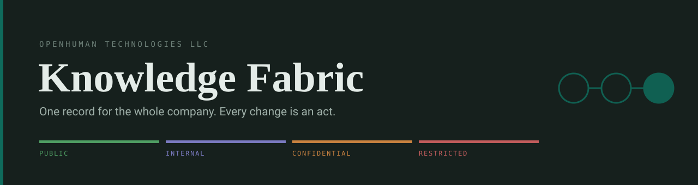
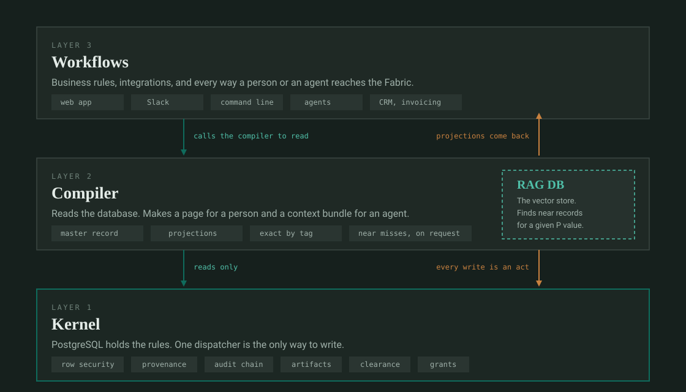

[](https://github.com/Quitetall/openhuman-knowledge-fabric/actions/workflows/ci.yml)
[](LICENSE)
[](docs/deployment/private-host.md)
[](package.json)

# Knowledge Fabric

A company's records live in a dozen systems that each think they are the source of truth. Ask
"what is the state of this work" and somebody assembles the answer from five screens, knowing
which system to disbelieve.

The Knowledge Fabric is one database that answers that question, without pretending the other
systems do not exist. It keeps a typed record of every project, document, decision, artifact,
work order, test, invoice and person, records which system owns each fact, and refuses any
change that is not an attributed act.

It is a backend. People and other applications reach it through the layers above it.

## What it does

- **Keeps one record.** Every object has a type, an owner, a history and a secrecy level.
- **Refuses untracked change.** There are 151 kinds of act. There is no generic write endpoint.
- **Proves what happened.** Every act appends to an audit chain that verifies on its own.
- **Shows each person exactly what they may see.** Not more, not less, and it can say why.
- **Reads for machines first.** A human page is compiled from the record, not stored instead of it.
- **Serves agents.** The same record compiles into a context bundle for retrieval and reasoning.
- **Keeps the bytes.** Files are stored with digests and verified before they are served.

## How it is built



**The kernel** is PostgreSQL. The rules live in the database, not in application code: row-level
security, triggers, check constraints and foreign keys decide what a caller may see and change.
TypeScript opens one transaction and dispatches into it. A defect in the application cannot
widen those rules.

**The compiler** reads the database. It is a consumer, not part of the kernel. It produces the
master record, which is exactly the set of records one person may see at one moment, and
projections over it: a readable page for a person, a context bundle for an agent, a view of one
object and its neighbours. The retrieval index sits inside the same boundary; LAMU is the engine
we run in that role. It finds records near a question, and those results stay in a separate
labelled set a caller has to ask for.

**The workflows** sit on top and call the compiler. Business rules live here: invoicing
arithmetic, scheduling, CRM. So do the integrations and every way a record gets in, whether an
agent, Slack, the command line or a web form. All of them dispatch the same acts through the
same seam. None of them touches storage directly.

## Status

Operational for development and draft use. **Not an authoritative service yet.**

|                  |                                                      |
| ---------------- | ---------------------------------------------------- |
| Phases delivered | 9 of 11                                              |
| Tests            | 1,520 across 151 files, against a real PostgreSQL 18 |
| Remaining        | Phase 9, commission a host. Phase 10, version 1.0    |

The single source of truth for program state is the
[Software Architecture Specification](docs/sas/KF_Software_Architecture_Specification.md). Its
§98 lists the phases, §99 the acceptance criteria and §100 every known gap. Where this README
and that document disagree, that document is right.

## Getting started

```sh
pnpm install
cp .env.example .env
set -a; . ./.env; set +a
docker compose up -d                                  # PostgreSQL 18, MinIO, Keycloak
DATABASE_URL="$DATABASE_OWNER_URL" pnpm db:migrate
pnpm dogfood:load -- --source-dir /path/to/documents   # prints three KF_DEV_* values for .env
pnpm dev                                              # api :4000, web :3000, worker
```

Then open <http://localhost:3000/documents>.

Requires Node 24.18.1, pnpm 11, and Docker with Compose v2.
[`docs/onboarding.md`](docs/onboarding.md) is the same path with the traps written down.

## The command line

```sh
kf ingest --mode=copy --classification=internal --identity=oidc <files...>
kf master-record --token-file <file> --organization <uuid> --acting-role <uuid>
kf overview
kf bootstrap-organization --legal-name "..." --person "..."
kf grant-authority --person <uuid> --role <id> --clearance <id> --reason "..."
kf retire-organization --organization <uuid> --decided-by <uuid> --reason "..."
```

`scripts/install-kf.sh` puts `kf` on your path.

## Testing and CI

```sh
pnpm gate          # everything CI runs, in CI's order, fail-fast
```

Four jobs run on every push and pull request:

| Job        | Checks                                                              |
| ---------- | ------------------------------------------------------------------- |
| `verify`   | format, lint, typecheck, the full test suite, dependency advisories |
| `ontology` | the ontology is consistent and `generated/` is current              |
| `build`    | the project builds from a clean checkout                            |
| `secrets`  | no secret has ever been committed, over full history                |

`pnpm gate` reproduces three of the four CI jobs. The fourth, `secrets`, scans the full history
and cannot run on every machine. `tests/deployment/gate-parity.test.ts` asserts that the gate and
the workflow run the same commands, so a step added to one and not the other fails the suite.

The suite starts real PostgreSQL 18 containers through Testcontainers. On a loaded machine, run
it in partitions rather than all at once.

## The rules

Breaking one of these is a defect, not a style choice.

1. **One authority per fact.** Every record names its authority, and a mirror is always
   distinguishable from the original. Indexes, embeddings and summaries are derived and never
   authoritative.
2. **Every controlled write is an act** naming the actor, their role, the reason and the time.
3. **A refusal is a feature.** Every refusal carries a named code, never an untyped error.
4. **Fail closed.** If a check cannot run, the system refuses.
5. **Identity never changes meaning.** An identifier is never reissued or re-meant, and the
   requester never chooses it.
6. **Retire by sequester, never delete.** Withdrawal, revocation and supersession leave the
   record in place.
7. **Canonical before hashed.** Every digest is taken over an RFC 8785 canonical form.

## What it is not

Not a wiki: there is no free page anyone can edit. Not merely a file store: the record is the
typed object, and the bytes are one attachment to it. Not a replacement for a PLM, QMS, finance
ledger or version control, which it links to and records the origin of. Not a general-purpose
write API. Business logic is an application above it, never inside it.

It holds no health information, no bank details and no payroll secrets. It does not sync
folders; each external file is admitted as a decision.

## Where things live

| Path         | Contents                                                                             |
| ------------ | ------------------------------------------------------------------------------------ |
| `ontology/`  | Object, relation, action and state definitions. The canonical semantics              |
| `generated/` | Compiler output. Never hand-edited; the gate fails on drift                          |
| `database/`  | SQL migrations, functions, triggers, constraints, row security                       |
| `packages/`  | Domain, database, actions, authorization, artifacts, export, search, projections, UI |
| `apps/`      | `api` (Fastify), `web` (Next.js), `worker`, `checkpoint`, `kf-storage`               |
| `fixtures/`  | A demonstration company that exercises every path end to end                         |
| `examples/`  | Real master records, exactly as the API returned them                                |
| `docs/`      | Specification, decisions, deployment, security, warrants                             |
| `tests/`     | Conformance, database, permissions, round-trip, deployment, planted violations       |

Each package carries an `AUTHORITY.md` saying which facts it may own. Most own none, which is
the common and correct case.

## Documentation

| Document                                                            | Answers                                  |
| ------------------------------------------------------------------- | ---------------------------------------- |
| [Specification](docs/sas/KF_Software_Architecture_Specification.md) | What it is, every requirement, every gap |
| [Decisions](docs/decisions/)                                        | Why it is this way. 27 records           |
| [Onboarding](docs/onboarding.md)                                    | How to run it, with the traps            |
| [Private host](docs/deployment/private-host.md)                     | How to deploy it properly                |
| [Identity and login](docs/deployment/identity-and-login.md)         | How a person gets an account             |
| [Security](docs/security/) and [threat model](docs/threat-model/)   | What it defends against                  |

## Why the durable record is a file

Retention here is unbounded, so records written now must stay readable indefinitely. No database
format survives that: a 2026 `PGDATA` will not mount on a 2045 server. So the preservation
export, canonical JSON with a signed manifest, is the institutional record, and PostgreSQL is
the operational engine over it. A round-trip test keeps that claim true.

## Repository boundaries

GitHub cannot restrict read access by path, so anything with a narrower audience belongs in a
different repository. Fixing that later means rewriting history.

| Repository          | Audience                       | Holds                              |
| ------------------- | ------------------------------ | ---------------------------------- |
| this one            | Staff                          | Implementation, ontology, schemas  |
| `openhuman-quality` | Staff, auditors, notified body | QMS, product files, validation     |
| `openhuman-ip`      | Legal and named inventors      | Invention disclosures              |
| `LamQuant`          | Engineering                    | Design source, analysis, decisions |

Health information never enters any repository. Bank details, tax identifiers and payroll
secrets are never stored in this system at all; they stay in restricted systems and are
referenced, never copied.

## Licence

[Apache 2.0](LICENSE). Copyright OpenHuman Technologies LLC, stated in [`NOTICE`](NOTICE).

Use it for anything, including commercially and in closed-source products. The patent grant is
included. Keep the `LICENSE` and `NOTICE` with copies you distribute. The OpenHuman name and
logo are not granted. [ADR 0005](docs/decisions/0005-apache-2-0-licence.md) records why this is
Apache 2.0 rather than a source-available licence.
