<!-- GENERATED from ontology/ — do not edit. -->
<!-- ontology_version: 1.1.0-draft.1 · source_digest: b6b322c1392676a52dc8fc76e0866354aaa438b0f2bff24f1735dfaeaa780a5e -->

# Ontology reference

Compiled from `ontology/`. 39 object types, 41 relation types, 145 action types, 22 state machines, 15 invariants, 4 corpus projections.

## Object types

| Type | Authority | Enterprise namespace | Lifecycle | States |
|---|---|---|---|---|
| `organization` | organization | — | — | 3 |
| `person` | organization | — | — | 2 |
| `role_assignment` | organization | — | — | 3 |
| `engagement` | commercial | — | — | 5 |
| `product_system` | configuration | ITM | — | 5 |
| `initiative_project` | project | PRJ *(proposed)* | initiative_project | 10 |
| `work_package` | project | — | work_package | 8 |
| `work_order` | commercial | WRK | work_order | 9 |
| `work_execution` | commercial | RCD | work_execution | 7 |
| `decision_record` | engineering | ADR | decision_record | 6 |
| `change_record` | configuration | CHG | change_record | 8 |
| `deliverable` | project | — | — | 6 |
| `artifact` | artifact | — | — | 5 |
| `acceptance_record` | commercial | RCD | — | 3 |
| `invoice` | finance | RCD | invoice | 7 |
| `payment` | finance | RCD | payment | 7 |
| `requirement` | qms | REQ | — | 5 |
| `risk` | qms | RSK | — | 5 |
| `test` | qms | TST | — | 6 |
| `release` | configuration | RLS | — | 4 |
| `baseline` | configuration | BSL | — | 4 |
| `configuration_item` | configuration | CFG | configuration_item | 4 |
| `interface_contract` | configuration | IFC | interface_contract | 4 |
| `physical_binding` | configuration | BND | physical_binding | 3 |
| `controlled_document` | qms | DOC | controlled_document | 6 |
| `authored_fragment` | qms | — | authored_fragment | 2 |
| `document_composition` | qms | — | — | 1 |
| `ml_promotion_decision` | qms | — | — | 1 |
| `nonconformity` | qms | NCR | nonconformity | 5 |
| `capa` | qms | CPA | capa | 6 |
| `supplier` | qms | SUP | supplier | 4 |
| `equipment` | qms | EQP | equipment | 4 |
| `complaint` | qms | CMP | complaint | 4 |
| `risk_control` | engineering | RCT | risk_control | 4 |
| `test_definition` | engineering | TSD | test_definition | 3 |
| `test_execution` | engineering | TSX | test_execution | 5 |
| `milestone` | project | MST | — | 4 |
| `work_order_amendment` | commercial | AMD | — | 3 |
| `warrant` | project | WAR | warrant | 7 |

## Relation types

| Relation | Inverse | Acyclic |
|---|---|---|
| `contains` | contained_by | yes |
| `decomposes_into` | part_of | yes |
| `affects` | affected_by |  |
| `authorizes` | authorized_by |  |
| `executes` | executed_by |  |
| `produces` | produced_by |  |
| `consumes` | consumed_by |  |
| `proposes` | proposed_by |  |
| `governs` | governed_by |  |
| `implements` | implemented_by |  |
| `satisfies` | satisfied_by |  |
| `verifies` | verified_by |  |
| `mitigates` | mitigated_by |  |
| `accepts` | accepted_by |  |
| `bills` | billed_by |  |
| `settles` | settled_by |  |
| `allocates_to` | allocated_from |  |
| `originated_from` | originated |  |
| `supersedes` | superseded_by | yes |
| `derived_from` | source_of |  |
| `evidences` | evidenced_by |  |
| `assigned_to` | assignee_of |  |
| `scoped_to` | scope_of |  |
| `depends_on` | dependency_of | yes |
| `blocks` | blocked_by |  |
| `released_by` | releases |  |
| `baseline_contains` | included_in_baseline |  |
| `performed_by` | performed |  |
| `owned_by` | owns |  |
| `linked_to` | linked_to |  |
| `amends` | amended_by | yes |
| `extends` | extended_by | yes |
| `generated_by` | generated |  |
| `used` | was_used_by |  |
| `was_associated_with` | associated_with |  |
| `conforms_to` | conformed_to_by |  |
| `bound_to` | binds |  |
| `supplied_by` | supplies |  |
| `calibrated_with` | calibrates |  |
| `raised_against` | raised |  |
| `remediated_by` | remediates |  |

## Actions

| Action | Drives |
|---|---|
| `create_initiative` | — |
| `triage_initiative` | initiative_project |
| `authorize_project` | initiative_project |
| `activate_project` | initiative_project |
| `create_work_package` | work_package |
| `start_work_package` | work_package |
| `accept_work_package` | work_package |
| `issue_work_order` | work_order |
| `accept_work_order` | work_order |
| `amend_work_order` | — |
| `submit_work_execution` | work_execution, work_package |
| `review_work_execution` | work_execution, work_package |
| `issue_acceptance` | work_execution, work_order |
| `propose_decision` | decision_record |
| `accept_decision` | decision_record |
| `reject_decision` | decision_record |
| `supersede_decision` | decision_record |
| `open_change` | change_record |
| `approve_change` | change_record |
| `verify_change` | change_record |
| `make_change_effective` | change_record |
| `submit_invoice` | invoice |
| `approve_invoice` | invoice |
| `authorize_payment` | payment |
| `record_payment_settlement` | invoice, payment |
| `reconcile_payment` | payment |
| `complete_project_technical` | initiative_project |
| `close_project_administrative` | initiative_project |
| `attach_evidence` | — |
| `register_external_artifact` | — |
| `correct_record` | capa, change_record, decision_record, initiative_project, invoice, payment, work_execution, work_order, work_package |
| `promote_configuration_item` | configuration_item |
| `supersede_configuration_item` | configuration_item |
| `retire_configuration_item` | configuration_item |
| `publish_interface_contract` | interface_contract |
| `deprecate_interface_contract` | interface_contract |
| `withdraw_interface_contract` | interface_contract |
| `record_physical_binding` | physical_binding |
| `remove_physical_binding` | physical_binding |
| `add_controlled_document` | — |
| `submit_document_for_review` | controlled_document |
| `approve_controlled_document` | controlled_document |
| `make_document_effective` | controlled_document |
| `supersede_controlled_document` | controlled_document |
| `withdraw_controlled_document` | controlled_document |
| `add_authored_fragment` | — |
| `revise_authored_fragment` | — |
| `retire_authored_fragment` | authored_fragment |
| `add_document_composition` | — |
| `revise_document_composition` | — |
| `change_document_source_holder` | — |
| `request_document_compilation` | — |
| `compile_master_record` | — |
| `accept_document_compilation` | — |
| `publish_document_view` | — |
| `record_document_proposal` | — |
| `apply_document_proposal` | — |
| `release_person_entitlement_exclusion` | — |
| `grant_person_clearance` | — |
| `grant_access` | — |
| `revoke_access` | — |
| `replicate_artifact_version` | — |
| `verify_artifact_location` | — |
| `allocate_enterprise_identifier` | — |
| `request_secure_object_access` | — |
| `issue_secure_object_capability` | — |
| `revoke_secure_object_capability` | — |
| `consume_secure_object_capability` | — |
| `request_secure_object_erasure` | — |
| `record_secure_object_erasure` | — |
| `register_secure_object_authority_key` | — |
| `revoke_secure_object_authority_key` | — |
| `register_ml_aggregate_reference` | — |
| `register_ml_run_lineage` | — |
| `register_ml_metric_definition` | — |
| `register_ml_metric_segment` | — |
| `authorize_ml_metric_stream` | — |
| `append_ml_metric_event` | — |
| `authorize_ml_promotion` | — |
| `raise_nonconformity` | — |
| `contain_nonconformity` | nonconformity |
| `investigate_nonconformity` | nonconformity |
| `disposition_nonconformity` | nonconformity |
| `close_nonconformity` | nonconformity |
| `open_capa` | — |
| `approve_capa_plan` | capa |
| `implement_capa` | capa |
| `check_capa_effectiveness` | capa |
| `close_capa` | capa |
| `register_supplier` | — |
| `qualify_supplier` | supplier |
| `restrict_supplier` | supplier |
| `disqualify_supplier` | supplier |
| `register_equipment` | — |
| `place_equipment_in_service` | equipment |
| `remove_equipment_from_service` | equipment |
| `quarantine_equipment` | equipment |
| `retire_equipment` | equipment |
| `receive_complaint` | — |
| `triage_complaint` | complaint |
| `investigate_complaint` | complaint |
| `close_complaint` | complaint |
| `propose_risk_control` | — |
| `implement_risk_control` | risk_control |
| `verify_risk_control` | risk_control |
| `retire_risk_control` | risk_control |
| `define_test` | — |
| `approve_test_definition` | test_definition |
| `supersede_test_definition` | test_definition |
| `plan_test_execution` | — |
| `execute_test` | test_execution |
| `record_test_result` | test_execution |
| `invalidate_test_execution` | test_execution |
| `create_warrant_draft` | — |
| `revise_warrant_draft` | — |
| `submit_warrant` | warrant |
| `authorize_warrant_contract` | warrant |
| `withdraw_warrant_proposal` | warrant |
| `propose_warrant_amendment` | — |
| `authorize_warrant_amendment` | warrant |
| `reject_warrant_amendment` | — |
| `record_warrant_preflight` | warrant |
| `authorize_warrant_dispatch` | warrant |
| `attach_warrant_runtime_receipt` | — |
| `register_warrant_submission` | warrant |
| `open_warrant_blocker` | — |
| `resolve_warrant_blocker` | — |
| `pause_warrant` | — |
| `resume_warrant` | — |
| `propose_warrant_deviation` | — |
| `approve_warrant_deviation` | — |
| `reject_warrant_deviation` | — |
| `record_warrant_discovered_gap` | — |
| `register_warrant_artifact` | — |
| `register_warrant_evidence` | — |
| `attach_warrant_gate_run` | — |
| `record_warrant_inference` | — |
| `record_warrant_judgment` | — |
| `request_warrant_resolution` | — |
| `resolve_warrant` | warrant |
| `dispute_warrant_resolution` | — |
| `resolve_warrant_dispute` | — |
| `annul_warrant_resolution` | — |
| `supersede_warrant` | — |
| `deprecate_warrant` | — |

## Lifecycles

### `initiative_project`

Initial: `captured` · Terminal: `administratively_closed`, `rejected`, `cancelled`

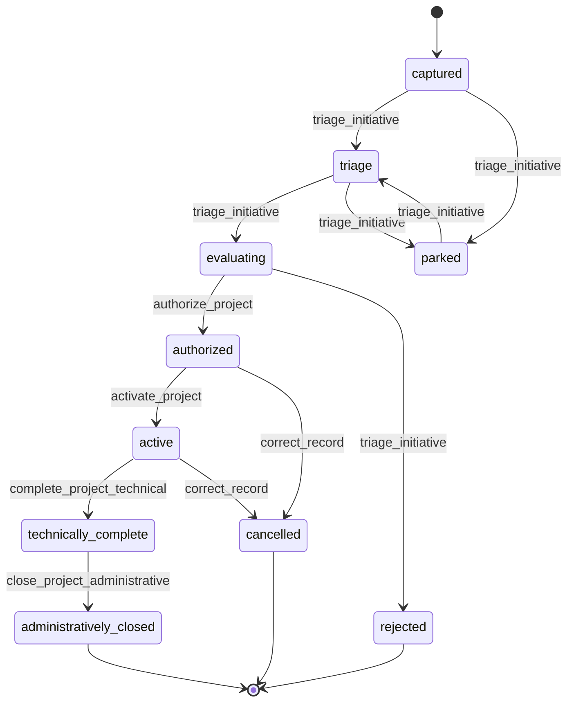
```mermaid
stateDiagram-v2
    [*] --> captured
    captured --> triage: triage_initiative
    triage --> evaluating: triage_initiative
    evaluating --> authorized: authorize_project
    authorized --> active: activate_project
    active --> technically_complete: complete_project_technical
    technically_complete --> administratively_closed: close_project_administrative
    captured --> parked: triage_initiative
    triage --> parked: triage_initiative
    parked --> triage: triage_initiative
    evaluating --> rejected: triage_initiative
    authorized --> cancelled: correct_record
    active --> cancelled: correct_record
    administratively_closed --> [*]
    rejected --> [*]
    cancelled --> [*]
```

### `work_package`

Initial: `planned` · Terminal: `accepted`, `waived`, `cancelled`

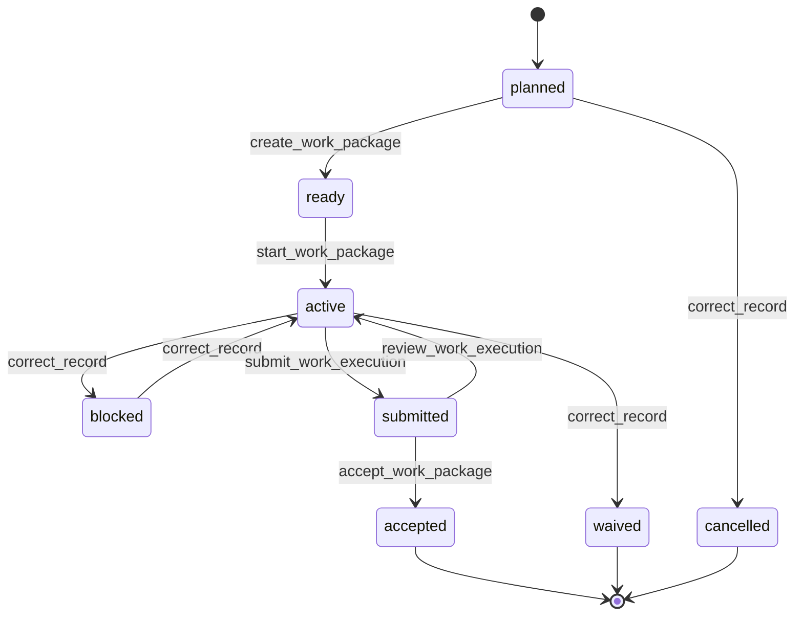
```mermaid
stateDiagram-v2
    [*] --> planned
    planned --> ready: create_work_package
    ready --> active: start_work_package
    active --> blocked: correct_record
    blocked --> active: correct_record
    active --> submitted: submit_work_execution
    submitted --> accepted: accept_work_package
    submitted --> active: review_work_execution
    planned --> cancelled: correct_record
    active --> waived: correct_record
    accepted --> [*]
    waived --> [*]
    cancelled --> [*]
```

### `work_order`

Initial: `draft` · Terminal: `closed`, `cancelled`, `terminated`

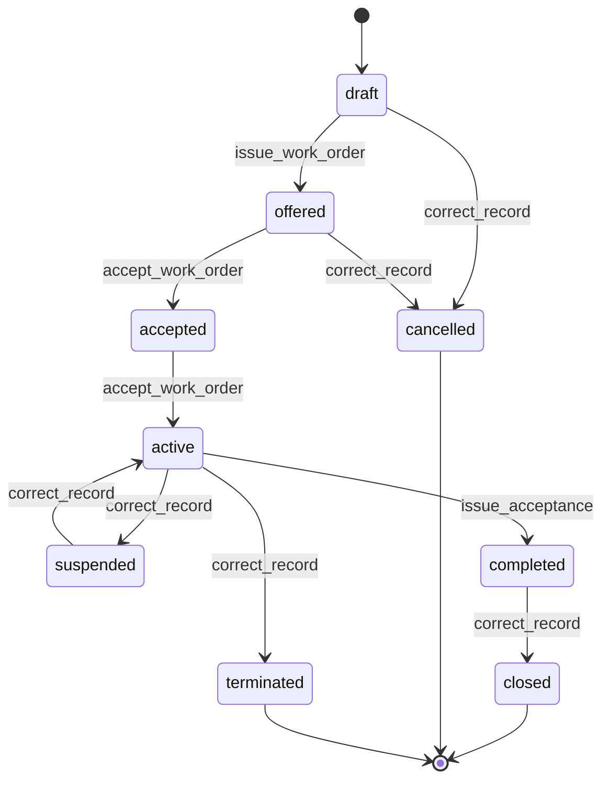
```mermaid
stateDiagram-v2
    [*] --> draft
    draft --> offered: issue_work_order
    offered --> accepted: accept_work_order
    accepted --> active: accept_work_order
    active --> suspended: correct_record
    suspended --> active: correct_record
    active --> completed: issue_acceptance
    completed --> closed: correct_record
    draft --> cancelled: correct_record
    offered --> cancelled: correct_record
    active --> terminated: correct_record
    closed --> [*]
    cancelled --> [*]
    terminated --> [*]
```

### `work_execution`

Initial: `draft` · Terminal: `accepted`, `partially_accepted`, `rejected`, `superseded`

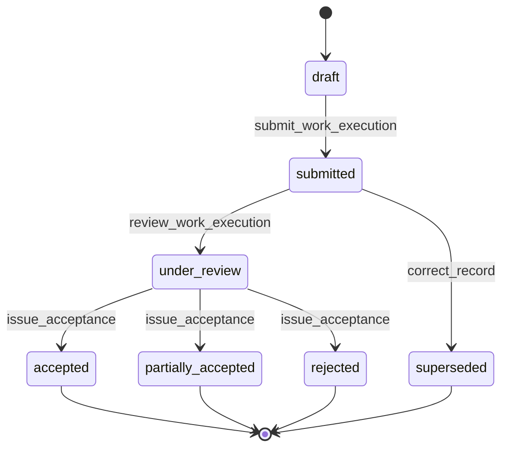
```mermaid
stateDiagram-v2
    [*] --> draft
    draft --> submitted: submit_work_execution
    submitted --> under_review: review_work_execution
    under_review --> accepted: issue_acceptance
    under_review --> partially_accepted: issue_acceptance
    under_review --> rejected: issue_acceptance
    submitted --> superseded: correct_record
    accepted --> [*]
    partially_accepted --> [*]
    rejected --> [*]
    superseded --> [*]
```

### `decision_record`

Initial: `draft` · Terminal: `rejected`, `superseded`, `withdrawn`

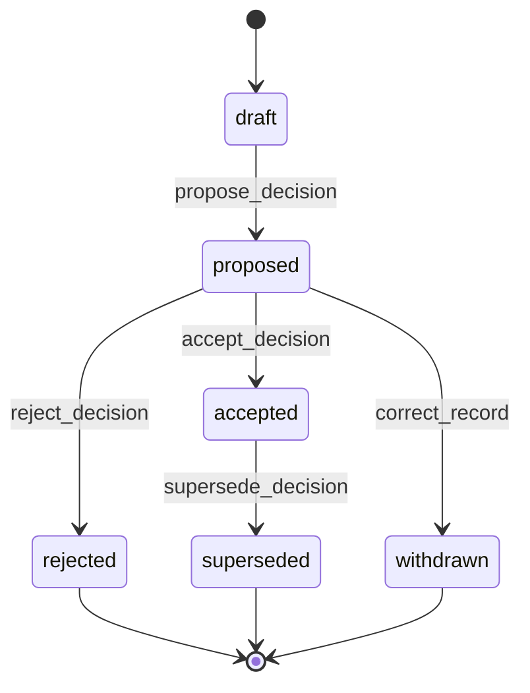
```mermaid
stateDiagram-v2
    [*] --> draft
    draft --> proposed: propose_decision
    proposed --> accepted: accept_decision
    proposed --> rejected: reject_decision
    proposed --> withdrawn: correct_record
    accepted --> superseded: supersede_decision
    rejected --> [*]
    superseded --> [*]
    withdrawn --> [*]
```

### `change_record`

Initial: `proposed` · Terminal: `closed`, `rejected`

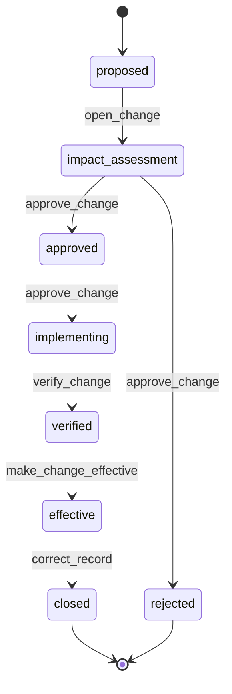
```mermaid
stateDiagram-v2
    [*] --> proposed
    proposed --> impact_assessment: open_change
    impact_assessment --> approved: approve_change
    impact_assessment --> rejected: approve_change
    approved --> implementing: approve_change
    implementing --> verified: verify_change
    verified --> effective: make_change_effective
    effective --> closed: correct_record
    closed --> [*]
    rejected --> [*]
```

### `invoice`

Initial: `draft` · Terminal: `paid`, `void`

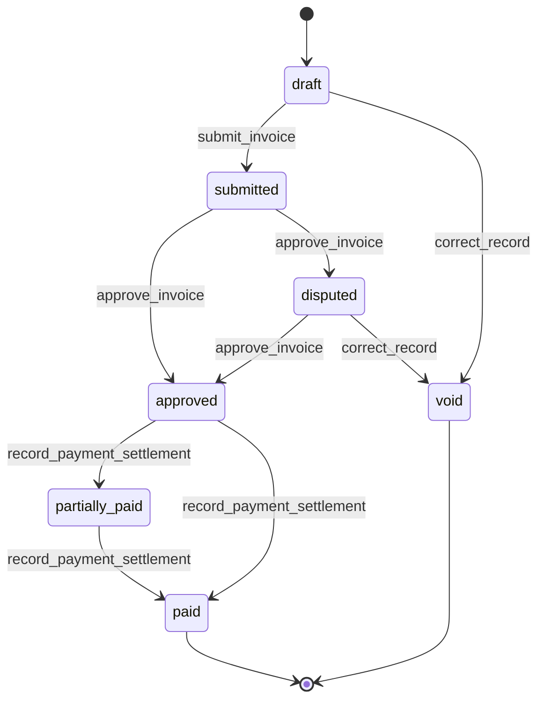
```mermaid
stateDiagram-v2
    [*] --> draft
    draft --> submitted: submit_invoice
    submitted --> approved: approve_invoice
    submitted --> disputed: approve_invoice
    approved --> partially_paid: record_payment_settlement
    approved --> paid: record_payment_settlement
    partially_paid --> paid: record_payment_settlement
    draft --> void: correct_record
    disputed --> approved: approve_invoice
    disputed --> void: correct_record
    paid --> [*]
    void --> [*]
```

### `payment`

Initial: `planned` · Terminal: `reversed`, `failed`

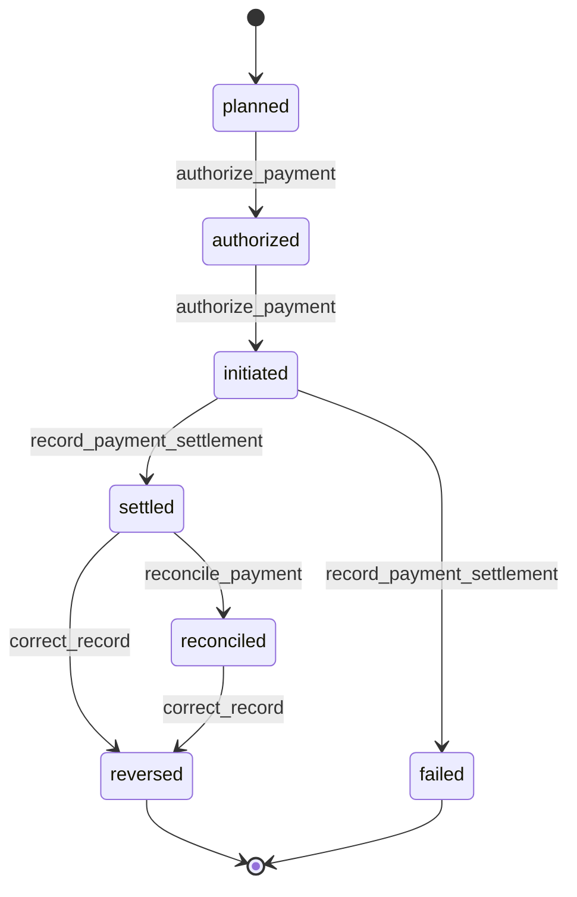
```mermaid
stateDiagram-v2
    [*] --> planned
    planned --> authorized: authorize_payment
    authorized --> initiated: authorize_payment
    initiated --> settled: record_payment_settlement
    settled --> reconciled: reconcile_payment
    initiated --> failed: record_payment_settlement
    settled --> reversed: correct_record
    reconciled --> reversed: correct_record
    reversed --> [*]
    failed --> [*]
```

### `configuration_item`

Initial: `proposed` · Terminal: `retired`

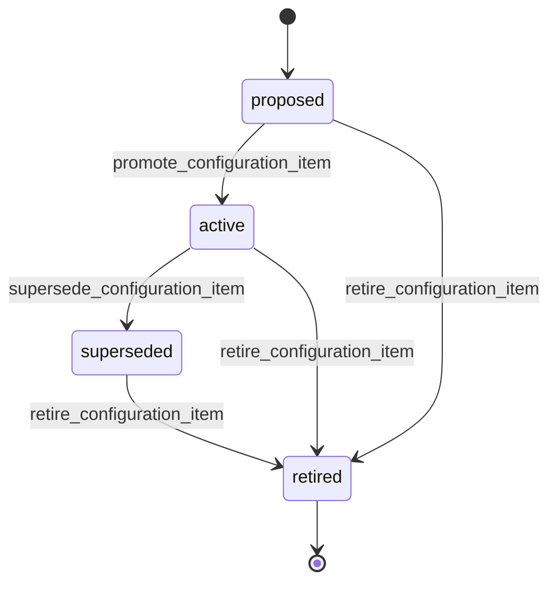
```mermaid
stateDiagram-v2
    [*] --> proposed
    proposed --> active: promote_configuration_item
    active --> superseded: supersede_configuration_item
    superseded --> retired: retire_configuration_item
    active --> retired: retire_configuration_item
    proposed --> retired: retire_configuration_item
    retired --> [*]
```

### `interface_contract`

Initial: `draft` · Terminal: `withdrawn`

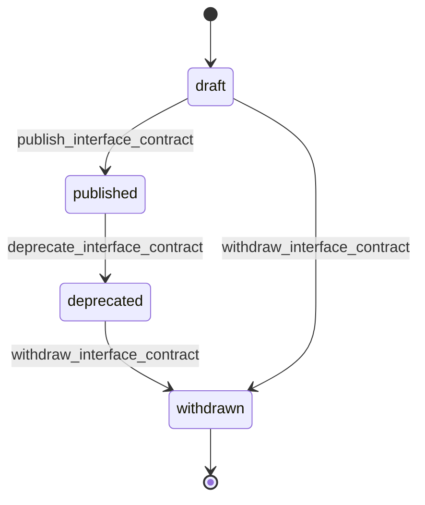
```mermaid
stateDiagram-v2
    [*] --> draft
    draft --> published: publish_interface_contract
    published --> deprecated: deprecate_interface_contract
    deprecated --> withdrawn: withdraw_interface_contract
    draft --> withdrawn: withdraw_interface_contract
    withdrawn --> [*]
```

### `physical_binding`

Initial: `planned` · Terminal: `removed`

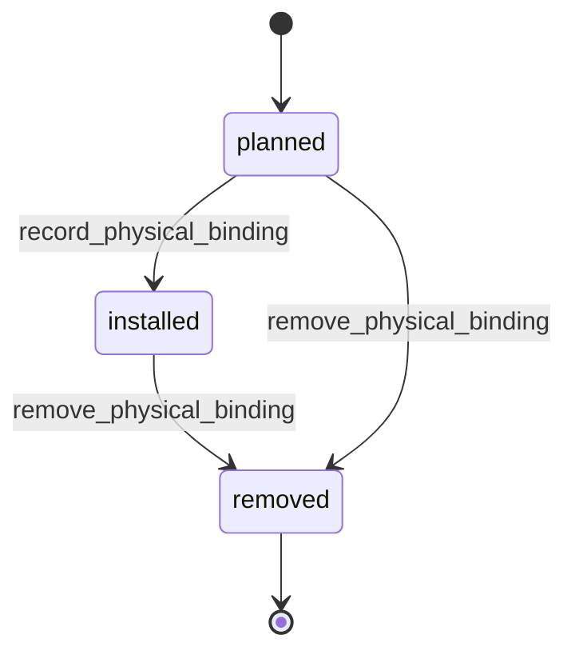
```mermaid
stateDiagram-v2
    [*] --> planned
    planned --> installed: record_physical_binding
    installed --> removed: remove_physical_binding
    planned --> removed: remove_physical_binding
    removed --> [*]
```

### `controlled_document`

Initial: `draft` · Terminal: `withdrawn`

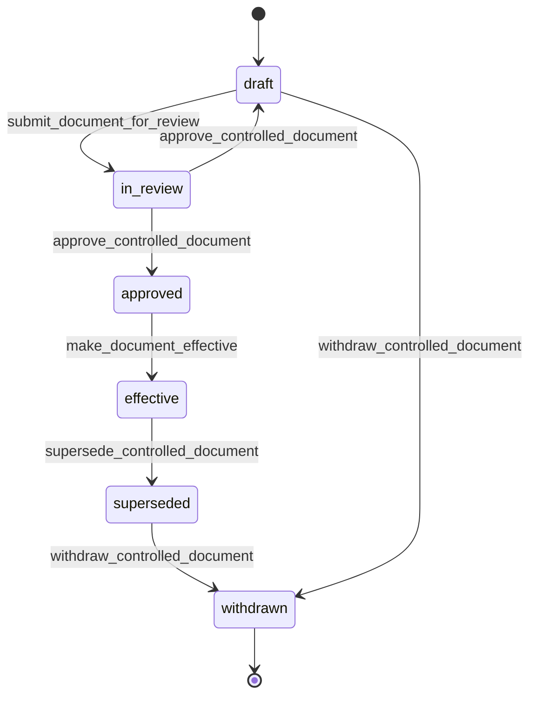
```mermaid
stateDiagram-v2
    [*] --> draft
    draft --> in_review: submit_document_for_review
    in_review --> approved: approve_controlled_document
    in_review --> draft: approve_controlled_document
    approved --> effective: make_document_effective
    effective --> superseded: supersede_controlled_document
    superseded --> withdrawn: withdraw_controlled_document
    draft --> withdrawn: withdraw_controlled_document
    withdrawn --> [*]
```

### `authored_fragment`

Initial: `active` · Terminal: `retired`

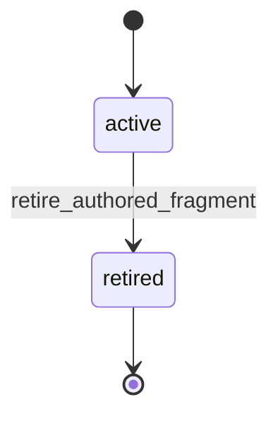
```mermaid
stateDiagram-v2
    [*] --> active
    active --> retired: retire_authored_fragment
    retired --> [*]
```

### `nonconformity`

Initial: `open` · Terminal: `closed`

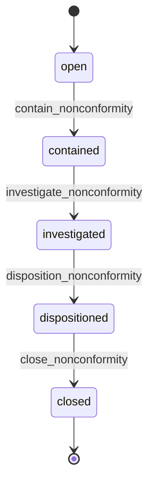
```mermaid
stateDiagram-v2
    [*] --> open
    open --> contained: contain_nonconformity
    contained --> investigated: investigate_nonconformity
    investigated --> dispositioned: disposition_nonconformity
    dispositioned --> closed: close_nonconformity
    closed --> [*]
```

### `capa`

Initial: `open` · Terminal: `closed`, `cancelled`

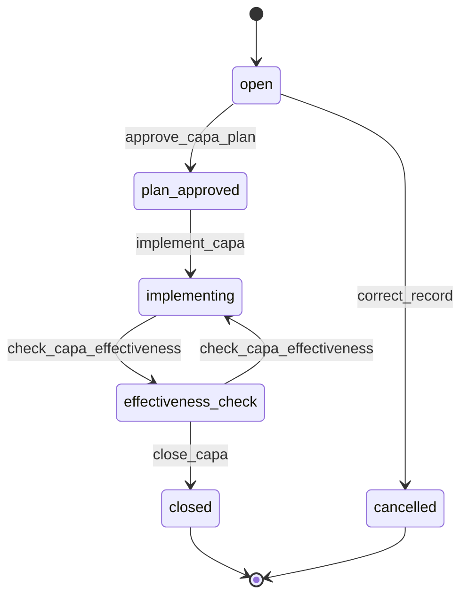
```mermaid
stateDiagram-v2
    [*] --> open
    open --> plan_approved: approve_capa_plan
    plan_approved --> implementing: implement_capa
    implementing --> effectiveness_check: check_capa_effectiveness
    effectiveness_check --> closed: close_capa
    effectiveness_check --> implementing: check_capa_effectiveness
    open --> cancelled: correct_record
    closed --> [*]
    cancelled --> [*]
```

### `supplier`

Initial: `prospective` · Terminal: `disqualified`

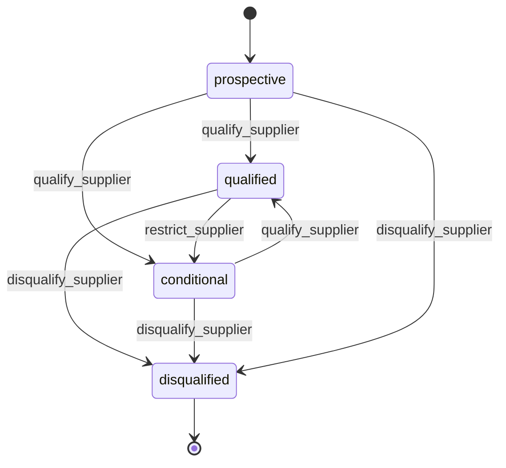
```mermaid
stateDiagram-v2
    [*] --> prospective
    prospective --> qualified: qualify_supplier
    prospective --> conditional: qualify_supplier
    qualified --> conditional: restrict_supplier
    conditional --> qualified: qualify_supplier
    qualified --> disqualified: disqualify_supplier
    conditional --> disqualified: disqualify_supplier
    prospective --> disqualified: disqualify_supplier
    disqualified --> [*]
```

### `equipment`

Initial: `in_service` · Terminal: `retired`

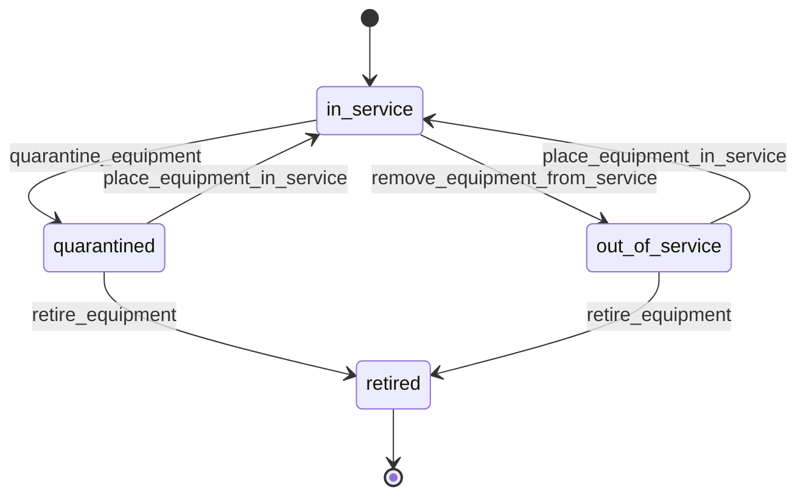
```mermaid
stateDiagram-v2
    [*] --> in_service
    in_service --> out_of_service: remove_equipment_from_service
    out_of_service --> in_service: place_equipment_in_service
    in_service --> quarantined: quarantine_equipment
    quarantined --> in_service: place_equipment_in_service
    quarantined --> retired: retire_equipment
    out_of_service --> retired: retire_equipment
    retired --> [*]
```

### `complaint`

Initial: `received` · Terminal: `closed`

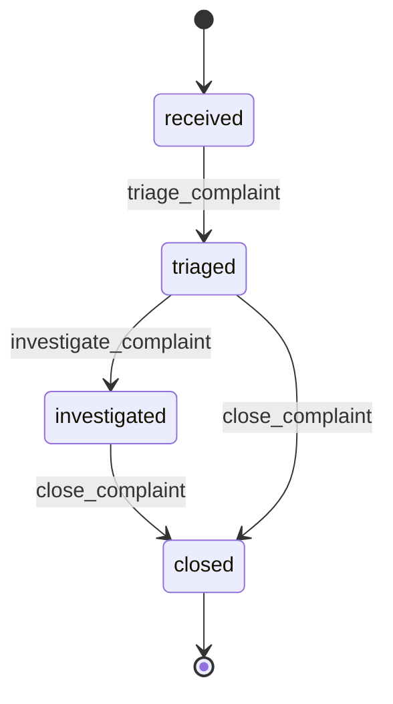
```mermaid
stateDiagram-v2
    [*] --> received
    received --> triaged: triage_complaint
    triaged --> investigated: investigate_complaint
    investigated --> closed: close_complaint
    triaged --> closed: close_complaint
    closed --> [*]
```

### `risk_control`

Initial: `proposed` · Terminal: `retired`

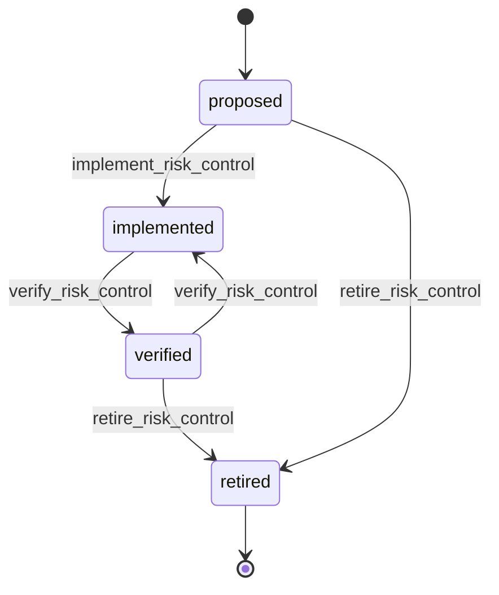
```mermaid
stateDiagram-v2
    [*] --> proposed
    proposed --> implemented: implement_risk_control
    implemented --> verified: verify_risk_control
    verified --> implemented: verify_risk_control
    verified --> retired: retire_risk_control
    proposed --> retired: retire_risk_control
    retired --> [*]
```

### `test_definition`

Initial: `draft` · Terminal: `superseded`

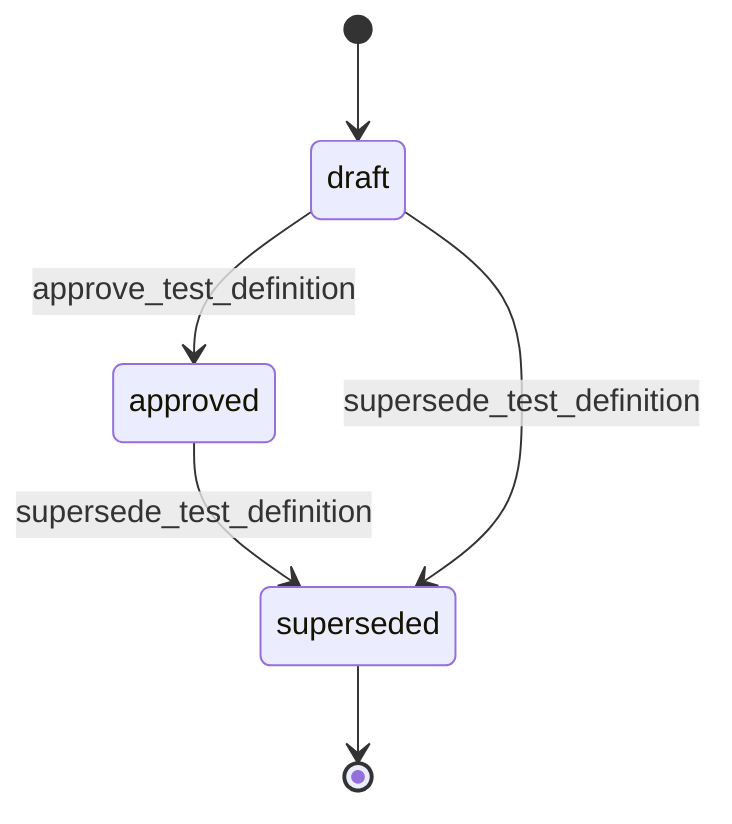
```mermaid
stateDiagram-v2
    [*] --> draft
    draft --> approved: approve_test_definition
    approved --> superseded: supersede_test_definition
    draft --> superseded: supersede_test_definition
    superseded --> [*]
```

### `test_execution`

Initial: `planned` · Terminal: `invalidated`

```mermaid
stateDiagram-v2
    [*] --> planned
    planned --> executed: execute_test
    executed --> passed: record_test_result
    executed --> failed: record_test_result
    passed --> invalidated: invalidate_test_execution
    failed --> invalidated: invalidate_test_execution
    executed --> invalidated: invalidate_test_execution
    invalidated --> [*]
```

### `warrant`

Initial: `draft` · Terminal: `resolved`

```mermaid
stateDiagram-v2
    [*] --> draft
    draft --> proposed: submit_warrant
    proposed --> draft: withdraw_warrant_proposal
    proposed --> authorized: authorize_warrant_contract
    authorized --> ready: record_warrant_preflight
    ready --> executing: authorize_warrant_dispatch
    executing --> verifying: register_warrant_submission
    verifying --> resolved: resolve_warrant
    ready --> authorized: authorize_warrant_amendment
    executing --> authorized: authorize_warrant_amendment
    verifying --> authorized: authorize_warrant_amendment
    resolved --> [*]
```

## Invariants

| Rule | Enforced at | Statement |
|---|---|---|
| `KF-GRAPH-001` | validator | Every edge source and target resolves to a node in the same graph view or a declared federated resource. |
| `KF-WORK-001` | database_constraint, validator | A work_execution references exactly one work_order. |
| `KF-WORK-002` | database_constraint, validator | A work_order references exactly one project and one engagement. |
| `KF-DEC-001` | action_precondition, validator | Accepted or rejected decision records are immutable; supersession creates a new decision record. |
| `KF-CHG-001` | action_precondition, validator | A change record implements, but never substitutes for, the decision rationale that authorized it. |
| `KF-FIN-001` | database_constraint, action_precondition, validator | Accepted value must not exceed authorized work-order ceiling without an approved amendment. |
| `KF-FIN-002` | database_constraint, action_precondition, validator | Invoice line value must not exceed accepted value available for the referenced work order. |
| `KF-FIN-003` | database_constraint, action_precondition, validator | Payment allocations must sum to no more than the payment amount and must not exceed invoice balances. |
| `KF-PROJ-001` | validator | Project progress is computed from accepted or waived work packages, not spending or activity count. |
| `KF-PROJ-002` | action_precondition, validator | Administrative project closure requires technical disposition plus closure of open work orders and financial obligations. |
| `KF-DOC-001` | database_constraint, action_precondition, validator | Every authored document subject has one current Source Holder and Holder changes use the narrow typed action. |
| `KF-DOC-002` | database_constraint, action_precondition, validator | A compilation run and its views must consume the exact Basis authorized by one prior compilation request action. |
| `KF-DOC-003` | database_constraint, action_precondition, validator | Each document subject has one immutable authoritative document policy that callers cannot weaken; Holder transfer, compilation acceptance and publication require scoped technical authority plus any quality authority required by that policy. |
| `KF-DOC-004` | database_constraint, action_precondition, validator | A Proposal Overlay is append-only; applying one requires a human-authorized typed action, an applied fragment remains a live draft, and no result is official before controlled review, effectivity and publication. |
| `KF-DOC-005` | database_constraint, action_precondition, validator | Every official document publication has one append-only receipt binding the exact accepted compiler result, effective controlled content revision and registered destination policy that authorized it. |

## Corpus projections

| Projection | Version | Traverse | Sections | Remainder |
|---|---|---|---|---|
| `master_sections` | 1 | person anchors ≤ 8 | `withdrawn` (withdrawn), `your_record` (reached), `org_view` (unreached) | `raw_corpus` |
| `raw_corpus` | 1 | — | — | `raw_corpus` |
| `agent_context` | 1 | person anchors ≤ 8 | `relevant` (reached), `organization` (unreached) | `raw_corpus` |
| `object_view` | 1 | all relations ≤ 1 | `subject` (anchor), `relationships` (reached) | `other` |
